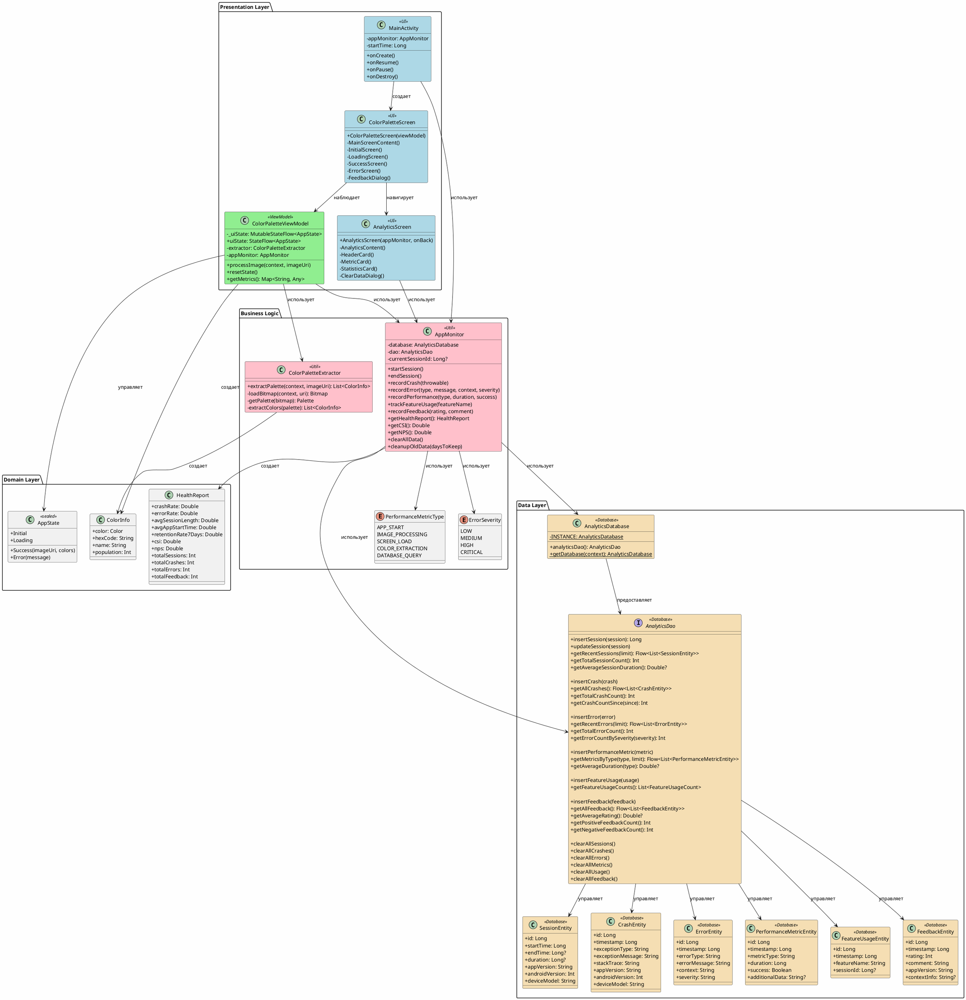
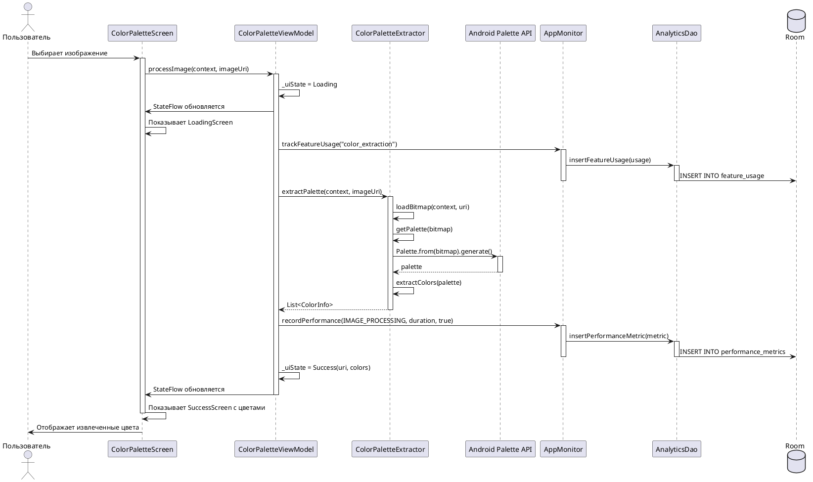
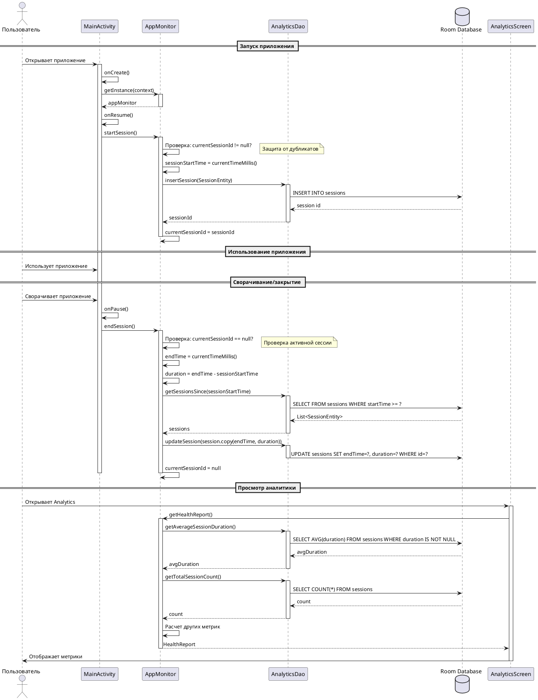
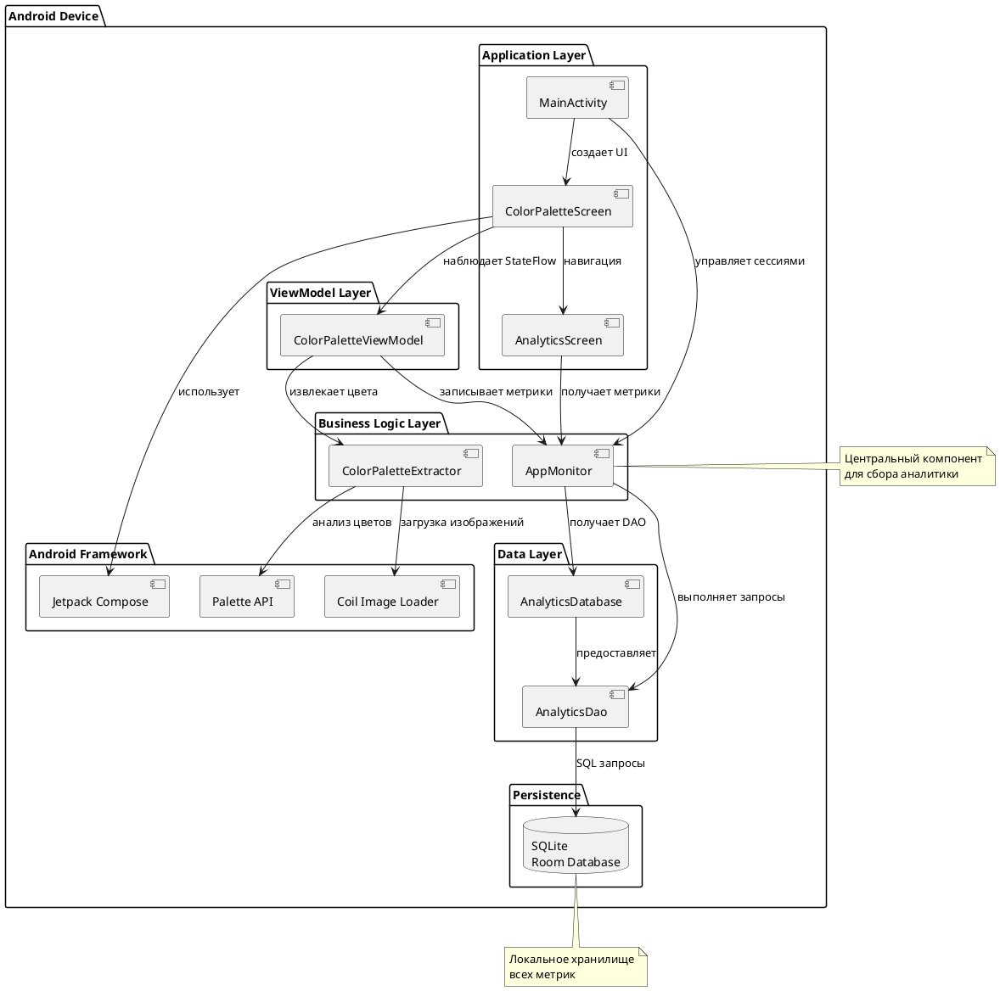
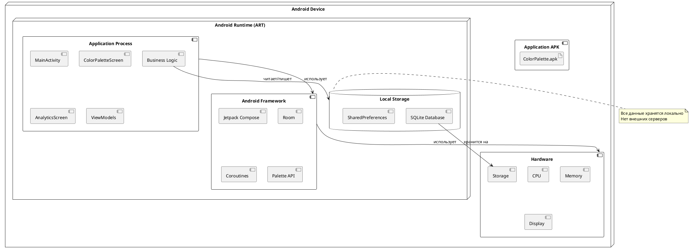

# UML Диаграммы

## Диаграмма классов

### PlantUML код

## Диаграмма последовательности - Извлечение цветов

### PlantUML код

## Диаграмма последовательности - Сбор аналитики сессий

### PlantUML код

## Диаграмма компонентов

### PlantUML код

## Диаграмма развертывания

### PlantUML код

## Использование диаграмм

### Для PlantUML

1. Установите PlantUML: https://plantuml.com/download
2. Или используйте онлайн редактор: https://www.plantuml.com/plantuml/uml/
3. Скопируйте код диаграммы
4. Вставьте в редактор
5. Экспортируйте в PNG/SVG

### Для Mermaid (альтернатива)

GitHub и многие Markdown редакторы поддерживают Mermaid диаграммы напрямую.

