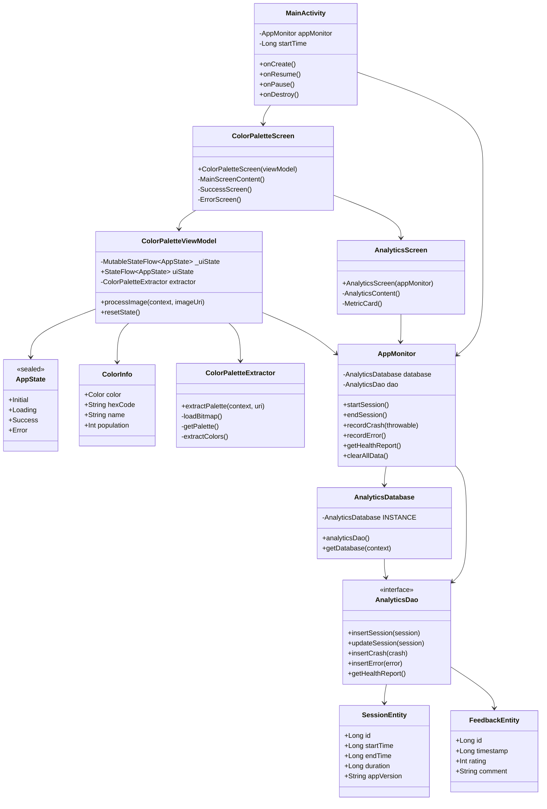
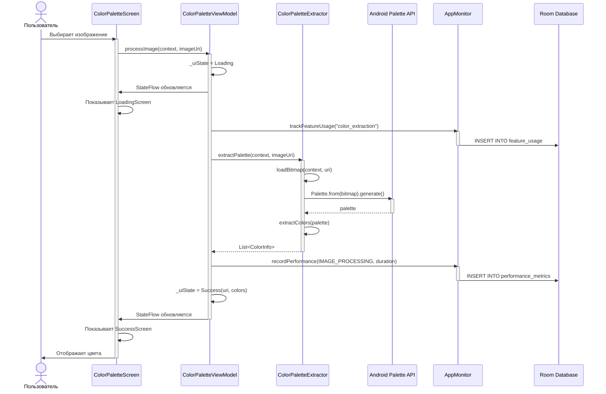
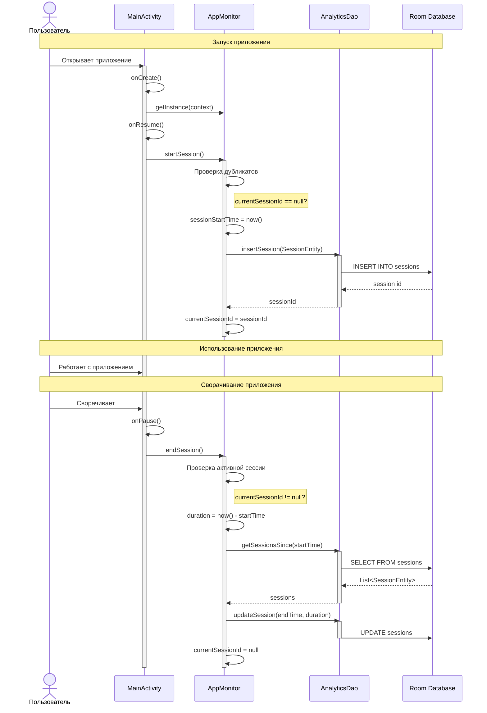
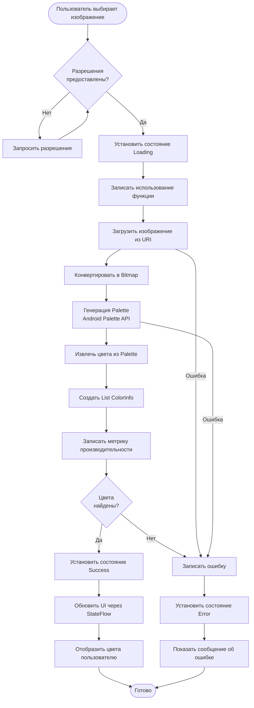
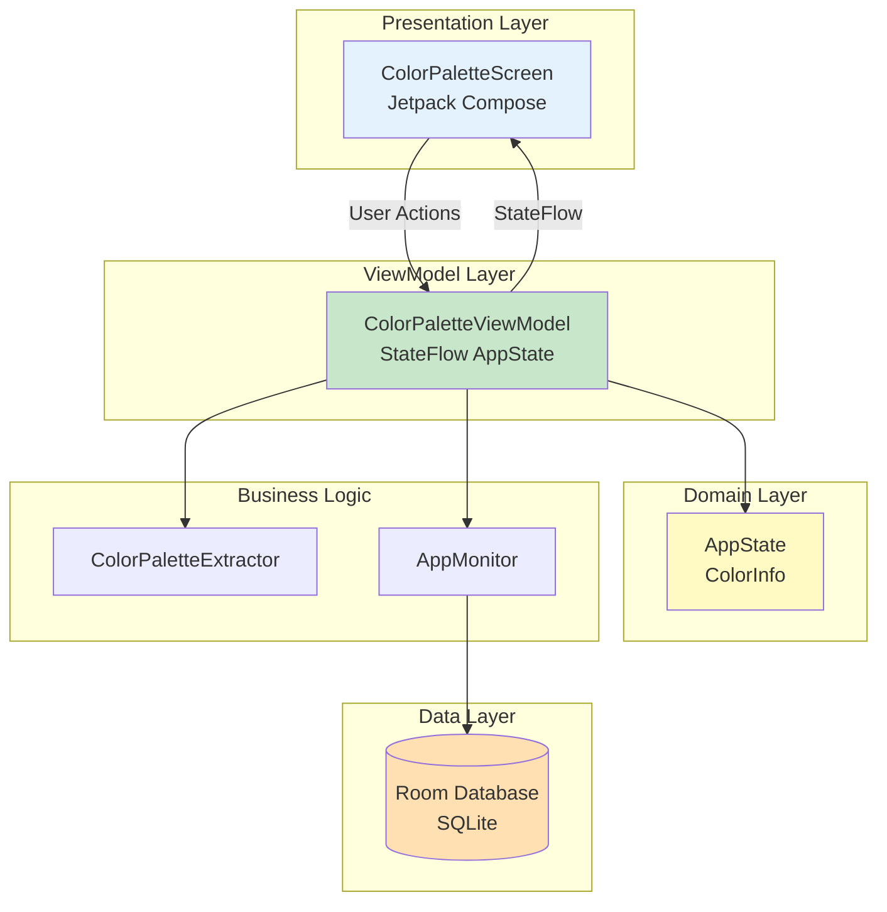
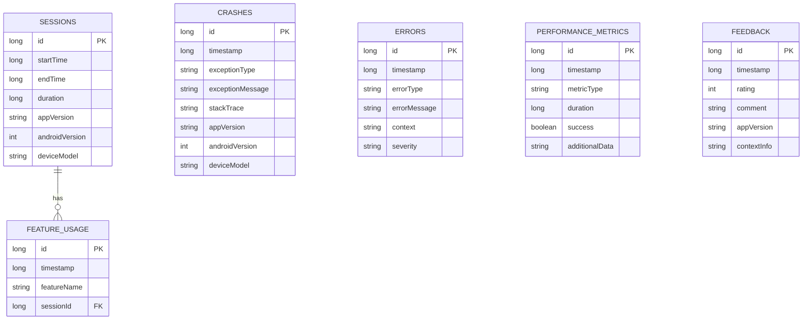
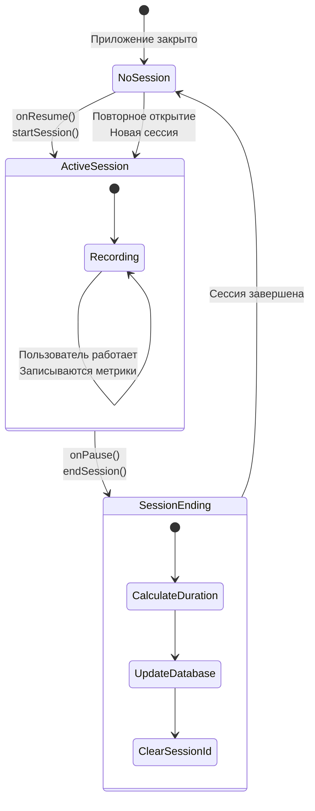
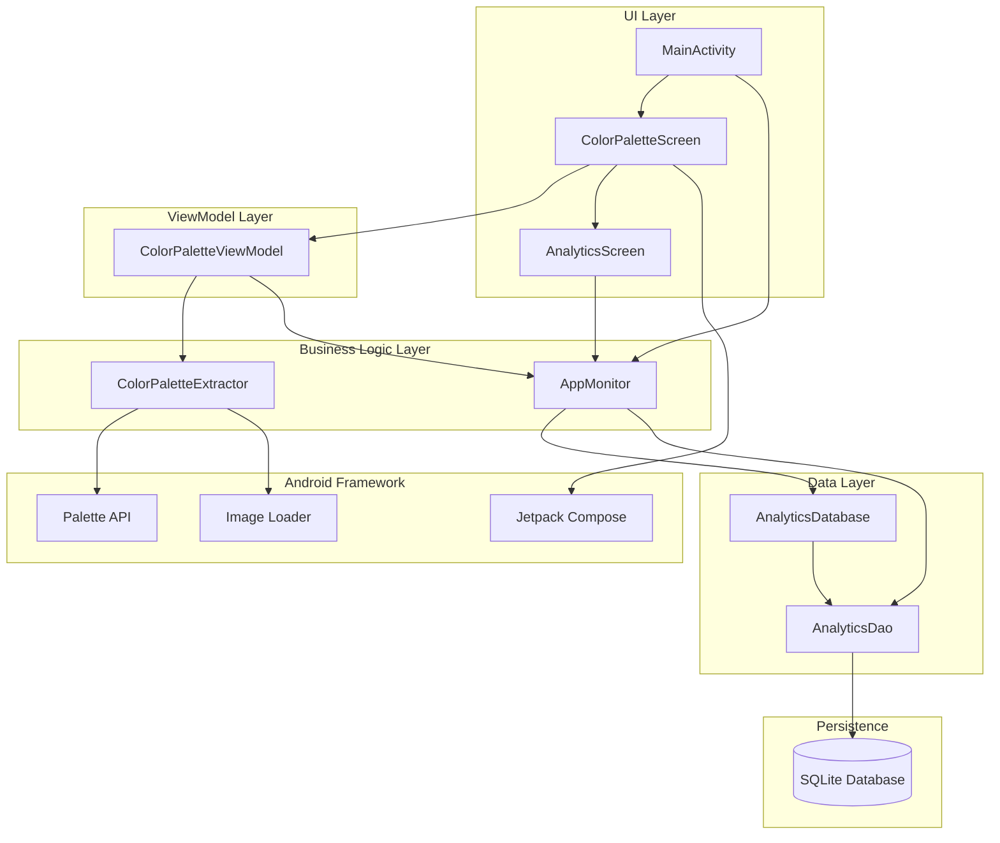

# UML Диаграммы (Mermaid формат)

## Диаграмма классов (упрощенная)

## Диаграмма последовательности - Извлечение цветов

## Диаграмма последовательности - Управление сессиями

## Диаграмма потока данных

## Архитектура MVVM

## Структура базы данных

## Жизненный цикл сессии

## Компонентная архитектура

## Просмотр диаграмм

Эти диаграммы в формате Mermaid автоматически отображаются в:
- GitHub
- GitLab
- VS Code с расширением Mermaid
- Многих других Markdown редакторах

Для PlantUML диаграмм см. файл `DIAGRAMS.md`

